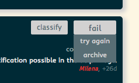
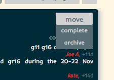
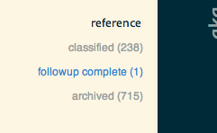
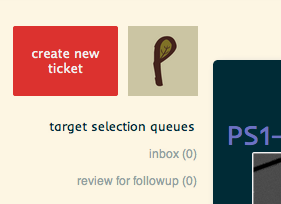
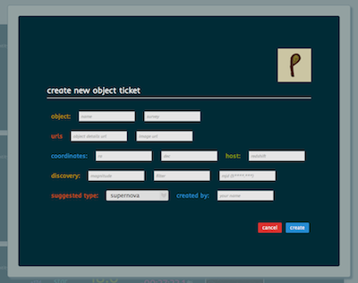
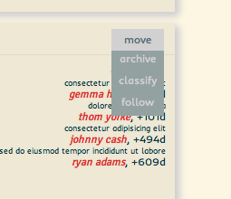

Marshall Release Notes[mrn]
======================

* All CRTS object predicted to be `HPM` or `Var` are archived from the inbox automatically.

January 25, 2013 v 0.7
------------------------
* CRTS ingester has been completely rewritten - the VOEvents coming from *skyAlerts* were unreliable at best. The marshall now parses the CRTS webpages for new objects. The lightcurve data for these objects (including the date of last non-detection) is lifted from the java-script used to build the CRTS lightcurve. Comments from the CRTS Circulars are also lifted and added to the Marshall in the *comments* field for the objects. The URLs currently parsed are:

| Sub Survey | URL |
|:----|:----|
| CSS SN | http://nesssi.cacr.caltech.edu/catalina/AllSN.html |
| MLS SN | http://nesssi.cacr.caltech.edu/MLS/AllSN.html |
| SSS SN | http://nesssi.cacr.caltech.edu/SSS/AllSN.html |
| CSS SN/CV? | http://nesssi.cacr.caltech.edu/catalina/AllSNCV.html |
| MLS SN/CV? | http://nesssi.cacr.caltech.edu/MLS/AllSNCV.html |
| SSS SN/CV? | http://nesssi.cacr.caltech.edu/SSS/AllSNCV.html |
| CSS Others | http://nesssi.cacr.caltech.edu/catalina/AllOth.html |
| MLS Others | http://nesssi.cacr.caltech.edu/MLS/AllOth.html |
| SSS Others | http://nesssi.cacr.caltech.edu/SSS/AllOth.html |

* The Marshall search function has been drastically improved - it was starting to take ~90s to search for an object, it now takes ~0.02s!
* Complete overhaul of the back-end code for the entire Marshall - this should make the marshall more stable.
* Logging is now included in all modules of the code making error checking and debugging much easier.
* Many minor modifications and bug fixes

December 4, 2012 v 0.65
------------------------
* Fixed a bug where LSQ last non-detection dates where not propagate if the LSQ team updated the date *AFTER* publishing their discovery.
* SDSS images are now taken from DR9 (originally DR7) - also if the object concerned is not in the SDSS survey area a statement to that effect is displayed where a blank image was original shown.
* CRTS object parsing has been put on hold - the VOEvent parsing consumed all the memory on the marshall web-server knocking the marshall off-line.
* A *fail* drop down menu has been added to the *queued for classification* list - if there's crap signal in the quick reductions, or nothing there at all, you can choose to just archive the object or move it back into the *classification targets* queue.

* Other minor bug fixes.

December 2, 2012 v 0.64
------------------------
* Added the ability to move objects from the *follow queue* to a *followup complete* list. This move option is available only for objects in the followup queue.

The *followup Complete* listing can be found in the reference section of the left sidebar.

Note you can move objects from the *followup complete* list back into the *followup queue* if, for instance, you wish to get some late time observations in a couple of months time.

November 30, 2012 v0.63
------------------------
* CRTS objects are now getting ingested from the voevent feeds brokered by [skyalerts](http://www.skyalert.org). **Currently the object MUST have a CRTS Circular released** to appear in the marshall inbox - this means that objects will not appear until someone (human within CRTS) has eyeballed the object and given it a predicted classification of *supernova* or *other*. The crts circular comments are automatically appended to the comment field for the related object in the marshall. The voevent feeds include:
	* CSS : within 5" of SDSS galaxy (css_ng)
	* CSS : flagged from P60 followup (css_p60)
	* CSS : all events with CRTS circular released (css_wc)
	* MLS : within 5" of SDSS galaxy (mls_ng)
	* MLS : flagged from P60 followup (mls_p60)
	* MLS : all events with CRTS circular released (mls_wc)
	* SSS : within 5" of SDSS galaxy (sss_ng)
	* SSS : flagged from P60 followup (sss_p60)
	* SSS : all events with CRTS circular released (sss_wc)

* Bug fix: alternative OGLE objects where not getting ingested due to small bug in the html parser.

* New screencasts added to the [Marshall Video Manual](marshall_help_and_reference.html)

#### The search bar ####

 <iframe width="640" height="480" src="http://www.youtube.com/embed/xGQp9MflcfQ" frameborder="0" allowfullscreen></iframe>

[watch this video on youtube](http://www.youtube.com/watch?v=xGQp9MflcfQ)

#### The sort bar ####

 <iframe width="640" height="480" src="http://www.youtube.com/embed/EmX0QUluz6g" frameborder="0" allowfullscreen></iframe>

[watch this video on youtube](http://www.youtube.com/watch?v=EmX0QUluz6g)

#### Building a Custom URL ####

 <iframe width="640" height="480" src="http://www.youtube.com/embed/xXT47gUF_K0" frameborder="0" allowfullscreen></iframe>

[watch this video on youtube](http://www.youtube.com/watch?v=xXT47gUF_K0)

November 23, 2012 : v0.62
-----------------------

* added cv and galaxy to drop-down classification list 
* fix bug that stopped marshall pages from being sorted by abs peak magnitude

2012-11-20 : v0.61
-------------------------

* OGLE events with full history are now automatically being added to the marshall. Many of the events are pretty old now, so someone from the targets team needs to clear them out. See the OGLE event page here:
http://ogle.astrouw.edu.pl/ogle4/transients/transients.html 
* If known, the last pre-discovery, non-detection date for an event is now displayed in the *object info* ticket block - very useful for selecting young targets.
* There's now a link in the top navigation bar of the marshall called *finder charts* - please use this as a repository for all pessto object finder charts (until I can get this built into the marshall).

2012-09-28 : v0.6
-------------------------

### Added Features
* Add a search bar - currently you can search by an object name (searches master name and akas). Partial name searches and regexs are allowed.
* Add a sort bar - currently you can sort via:
	- absolute magnitude
	- obsdate
	- Magnitude
	- identity
	- prediction
	- distance, redshift, mpc, z
	- ra
	- dec
	- classification  

### Bug fixes ###
* marshall asking for ptf credentials with requesting ptf images
* Semi-colons in comment truncating comments
* Absolute mag does not appear in either "Queued for ATEL" or "Classified" pages (for hosts where this is available).
* Very minor: Added LSQ12emi, added to observation targets, classified, selected "ATEL released". At some point, the target picked up a second alias. Currently in classified list.
* absolute magnitude determined from transient redshift not displayed
* Aliases (AKA) do not appear under the primary when a duplicate is entered (so user has no idea where their object went)
* Other minor bug fixes

2012-09-07 : v0.5 - first beta release
------------------------------------------------------

* The marshall workflow is now fully implemented within the marshall - an object can now be processed from the inbox and make it's way through the marshall, appearing in the relevant 'queues' at the correct time, see screencasts 001 and 002 for more details.
* Ability to create a new object 'ticket' from scratch using the 'create new object' button.

 

 

* Users now have the capability to classify objects within the marshall via a 'classify' button on the top left of the object ticket. This pulls down a dropdown form.

* add ability to comment on candidates

* Many bug fixes (I won't bore you with the details).
  

### Related Screencasts ###

**SC001**: A walkthrough of the marshall workflow.

 <iframe width="640" height="480" src="http://www.youtube.com/embed/pnNO6bPpbRM" frameborder="0" allowfullscreen></iframe>

[watch on youtube](http://www.youtube.com/embed/pnNO6bPpbRM)

**SC002**: An overview of the marshall interface

 <iframe width="640" height="480" src="http://www.youtube.com/embed/IS3R0gG_dBs" frameborder="0" allowfullscreen></iframe>

[watch this video on youtube](http://youtu.be/IS3R0gG_dBs)

2012-08-08 : v0.2
--------------------------

* 'Move' drop-down buttons added to object tickets - these provide the ability to push objects to the *inbox*, *obs queue* or *follow queue*. 

* Fixed : top navigation bar *marshall* link fixed. 
* Fixed (partially) : Marshall now displayed somewhat ok in Firefox (except for some strange image quirks to be ironed out).
* Fixed : Issue of blocked links and images of PS1 objects - username and password now bypassed.

2012-08-06 : v0.1
-------------------------

* Marshall displayed correctly in webkit based browsers (chrome & safari).
